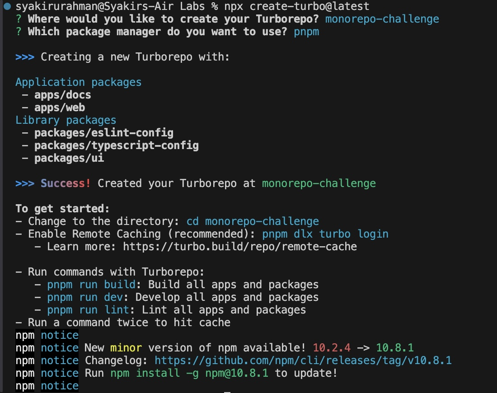

## Challenge - Create Monorepo With Turbo
In this challenge, you will have to complete the below tasks:

1. Run `npx create-turbo@latest` in a folder where you want to place your project.
2. Answer all the CLI prompts to configure your project.
3. Mark this step as completed to save your progress.

You should read [Turbo tutorial](https://turbo.build/repo/docs/getting-started/create-new#full-tutorial), execute the steps provided in the docs, and figure out how to create a Monorepo.

## Solution

### Step 1: Create Turbo project

Make sure you are in the folder where you want to create the project and open it in the Command line. Run this below command:

```
npx create-turbo@latest
```

### Step 2: Enter y to install create-turbo:

Press "y" when the CLI prompts to install create-turbo package.

Once this package is installed, you will be prompted with the following questions on your CLI:

### Step 3: Choose a folder location for your turborepo

_Where would you like to create your turborepo?_


Enter a new folder name for your Turbo project.

### Step 4: Choose a package manager:

_Which package manager do you want to use?_


Turbo recommends pnpm. Choose pnpm as your package manager.

After you choose the package manager, `create-turbo` package creates a bunch of files and folders inside your selected folder for Turborepo (Remember when you were asked this question above?) and also installs the dependencies that come with this basic example.

