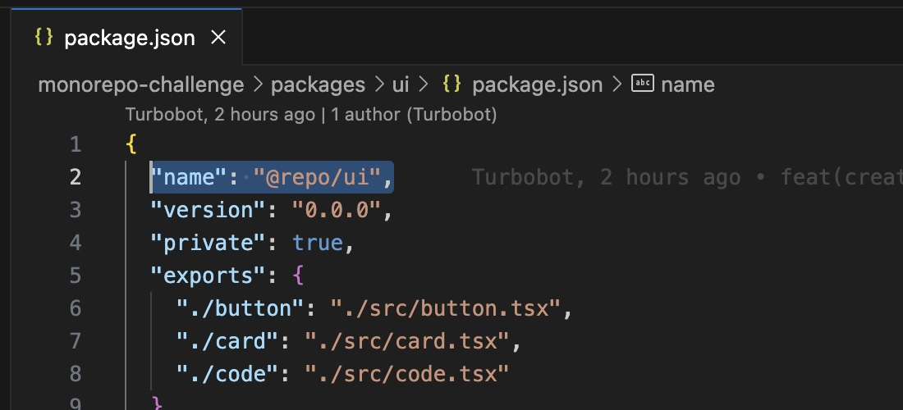
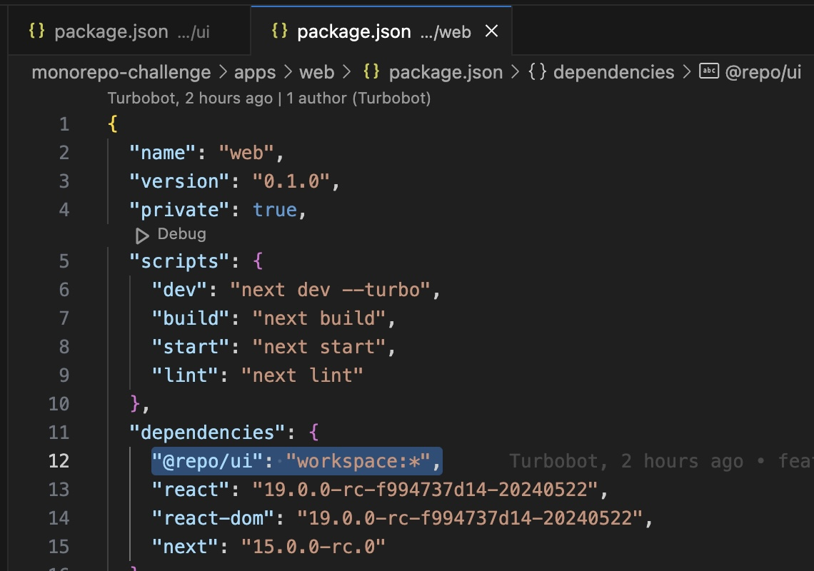
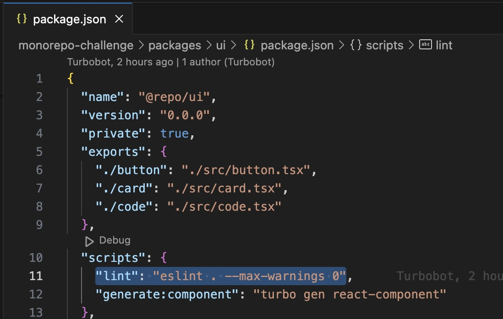
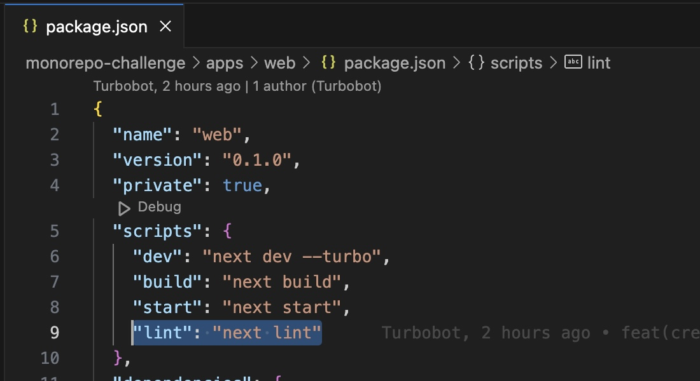

## Challenge - Understanding Turbo Monorepo
In this challenge, you will have to understand how the monorepo works based on the project you created before. You have to read the codes and making sense of them.

Make sure you understand the following basics provided in the Turbo docs:

1. [Running create-turbo](https://turbo.build/repo/docs/getting-started/create-new#1-running-create-turbo)
2. [Exploring your new repo](https://turbo.build/repo/docs/getting-started/create-new#2-exploring-your-new-repo)
3. [Understanding turbo.json](https://turbo.build/repo/docs/getting-started/create-new#3-understanding-turbojson)
4. [Linting with Turborepo](https://turbo.build/repo/docs/getting-started/create-new#4-linting-with-turborepo)
5. [Building with Turborepo](https://turbo.build/repo/docs/getting-started/create-new#5-building-with-turborepo)
6. [Running dev scripts](https://turbo.build/repo/docs/getting-started/create-new#6-running-dev-scripts)

## Solution

When you create a new monorepo, `create-turbo` command gives you a description of folders it creates.

```
>>> Creating a new turborepo with:

Application packages
 - apps/web
 - apps/docs
Library packages
 - packages/eslint-config
 - packages/typescript-config
 - packages/ui
```

These folders are called workspaces. Each workspace has its own package.json, runs its scripts, and exports code that can be used by other workspaces in the Monorepo.

### packages/ui, a shared component library

Open `package/ui/package.json` and you will find the name as `@repo/ui`.



If you open `apps/web/package.json` and `apps/docs/package.json`, you will find `@repo/ui` as a dependency.



`packages/ui` is a shared component library because `apps/web` and `apps/docs` depend on `packages/ui` for a consistent, single-design system

#### How does packages/ui share code?

Inside `./apps/docs/app/page.tsx`, you will find the below import.


Button is imported from `@repo/ui/button` but, how is this exported from `packages/ui`?

You will find `exports` field in `packages/ui/package.json`.


components from `packages/ui` are exported using the exports field.

For example, when `apps/web` workspace file imports a shared component, say `Button`, from `packages/ui`, `exports` tells the `apps/web` workspace where to find this Button component.


### typescript-config workspace

You will find that this workspace is named `@repo/typescript-config` in `packages/typescript-config/package.json`.

To share a single tsconfig.json across the monorepo, you can use this typescript-config workspace by importing `@repo/typescript-config/nextjs.json` in `apps/web/tsconfig.json`.


### eslint-config workspace

You will find that this workspace is named `@repo/eslint-config` in `packages/eslint-config/package.json`.

To share a single eslint config file across the Monorepo, you can use this eslint-config workspace by importing `@repo/eslint-config/next.js` in `apps/docs/.eslintrc.js`.


To summarise, the following list shows dependencies among workspaces:

1. `web` - depends on `ui`, `typescript-config`, and `eslint-config`
2. `docs` - depends on `ui`, `typescript-config`, and `eslint-config`
3. `ui` - depends on `typescript-config` and `eslint-config`
4. `typescript-config` - no dependencies
`eslint-config` - no dependencies

Turborepo CLI does not manage these dependencies. Your package manager (`npm`, `pnpm` or `yarn`) handles the workspace dependencies.

### `turbo.json` explained

Turborepo makes running tasks simpler and more efficient.

code inside `turbo.json`:

```
{
 "$schema": "https://turbo.build/schema.json",
 "tasks": {
 "build": {
 "dependsOn": ["^build"],
 "inputs": ["$TURBO_DEFAULT$", ".env*"],
 "outputs": [".next/**", "!.next/cache/**"]
 },
 "lint": {
 "dependsOn": ["^lint"]
 },
 "dev": {
 "cache": false,
 "persistent": true
 }
 }
}
```

What the code above means is that we have 3 tasks registered in `turbo.json`.

1. `build`
2. `lint`
3. `dev`

To run a specific task, you can use the command below:

```
turbo run <task>
```

or using a shorter version:

```
turbo  <task>
```

### turbo run lint

Run the command `turbo run lint` and notice what happens in your CLI.

Because workspaces such as `ui`, `docs` and `web` depend on eslint config provided by the shared workspace `eslint-config`, you will find that the command you just ran triggers the lint scripts in the dependent workspaces.

#### lint script in `ui` workspace



#### lint script in `web` workspace



#### lint script in `docs` workspace


You will also see `0 cached, 3 total` in your CLI.

#### Caching turbo task

Run the lint task without changing any code in workspaces, commands execute quickly and runtime is shorter because Turborepo recognizes that no code has been changed, hence it replays the previous task run log.

Let's make a change in `ui` workspace. Change the onClick method's alert message from:

```
<button
 className={className}
 onClick={() => alert(`Hello from your ${appName} app!`)}
>
```
to

```
<button
 className={className}
 onClick={() => 
 alert(`Hello there, this alert is from your ${appName} app!`)
 }
>
```

What we are changing is the alert message from `Hello from your ${appName} app!` to `Hello there, this alert is from your ${appName} app!`.

Run the lint again. You'll find that:

1. `ui:lint` has a comment saying `cache miss`, executing. This means that `ui` workspace is running its linting script.
2. `2 cached, 3 total` appears at the bottom.

Since only `ui` workspace had code changes, its lint script is run. Other workspace results are cached from previous runs.

### turbo run build

Check for the `build` key in `scripts` in `package.json`. You will find that `build` script is available only for `web` and `docs` packages since `ui` package is a shared workspace.

Run the below command to run the `build` scripts defined in `web` and `docs` workspaces.

```
turbo run build
```

#### Caching `build` results:

`outputs` defined in `build` task in `turbo.json` are the build outputs in workspaces. For example, in the `app/web`, once the `turbo build` is run, build script in `app/web` produces the Next.js build located at `./next` folder. 

`turbo` caches the folders mentioned in the build task's `outputs`

### turbo run dev

Run the below command.

```
turbo run dev
```
This above command executes the `dev` script in `web` and `docs` workspaces but not in `ui` workspace since it does not have `dev` script.

`dev` scripts are run simultaneously, starting the dev servers on ports `3000` and `3001`.

There is no caching in the `dev` task.

```
{
 "pipeline": {
 "dev": {
 "cache": false,
 "persistent": true
 }
 }
}
``` 

since `dev` command runs a development server and produces no results, the cache is disabled, and persistent is set to true. 

To run dev script in a specific workspace, use the below command.

```
turbo dev --filter docs
```