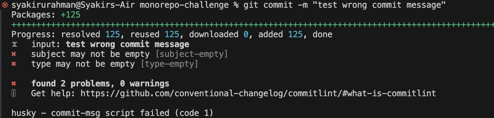

## Challenge - Test your commit-msg hook

Now, you can test your  `commit-msg` hook by creating a commit in the configured format before.

Make sure it's working properly!

## Solution

By default, `commitlint` lint your commit message with this format `[commit_type]: [commit_message]`. For instance:

```
feat: add x feature
```

You can test your commit-msg hook by staging `.husky` folder using the command below in your CLI:

```
git add .husky/
```

Let's write a commit message that does not adhere to `commitlint` rules.



Now let's write a commit message that adheres to `commitlint` rules.


> If you encounter the error `SyntaxError: Unexpected token 'export'` when running `git commit`, change the `export default` in `commitlint.config.js` to `module.exports =`

Further reading:
1. https://www.conventionalcommits.org/en/v1.0.0/
2. https://commitlint.js.org/reference/rules.html
3. https://github.com/conventional-changelog/commitlint/?tab=readme-ov-file#what-is-commitlint