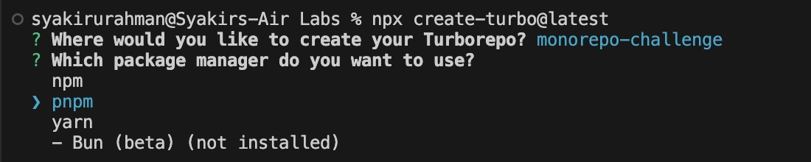
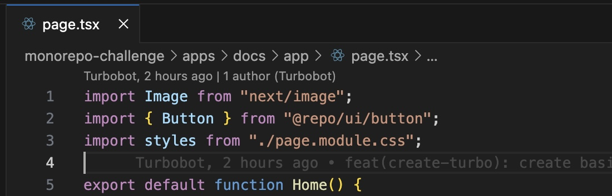
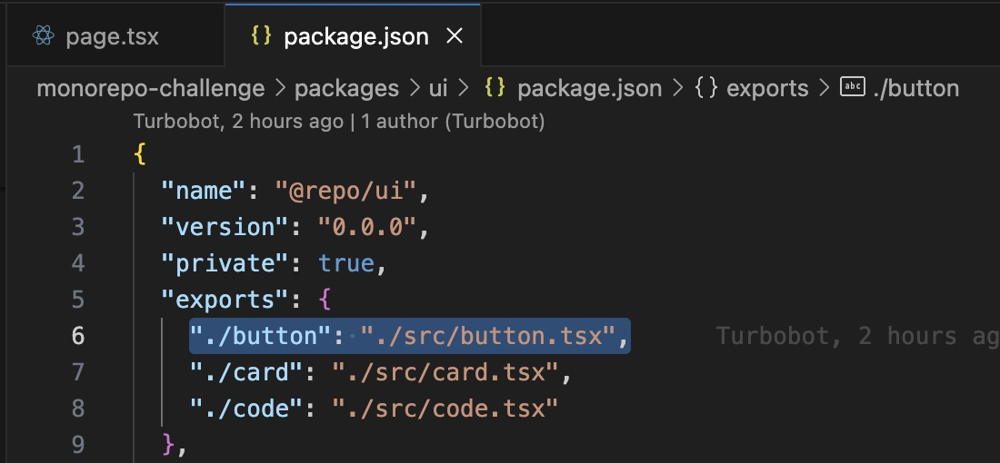
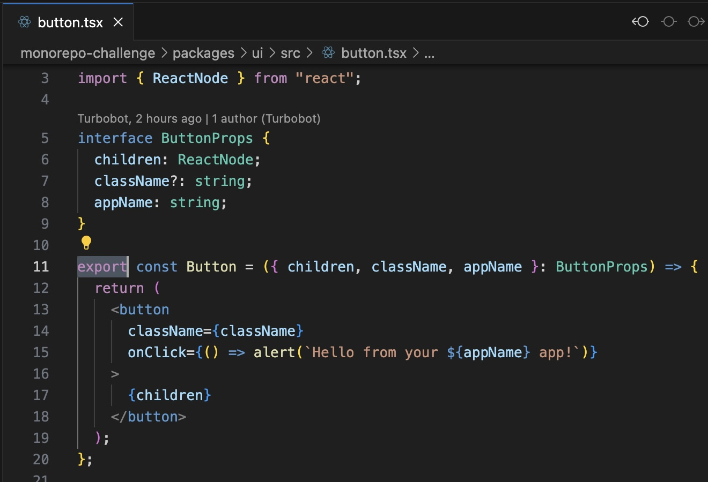
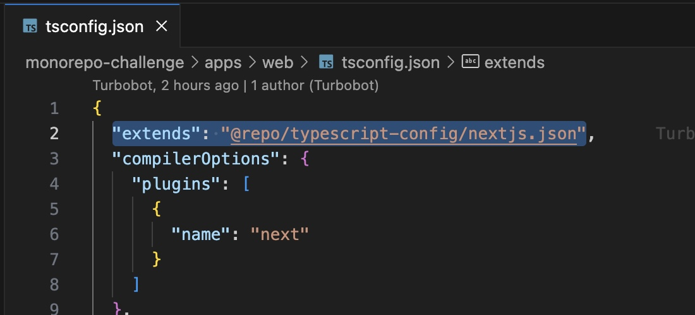
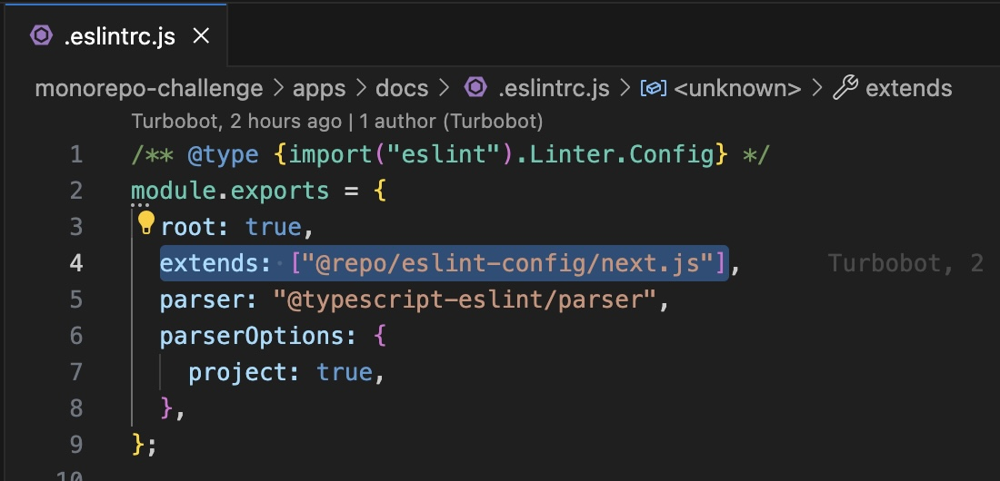
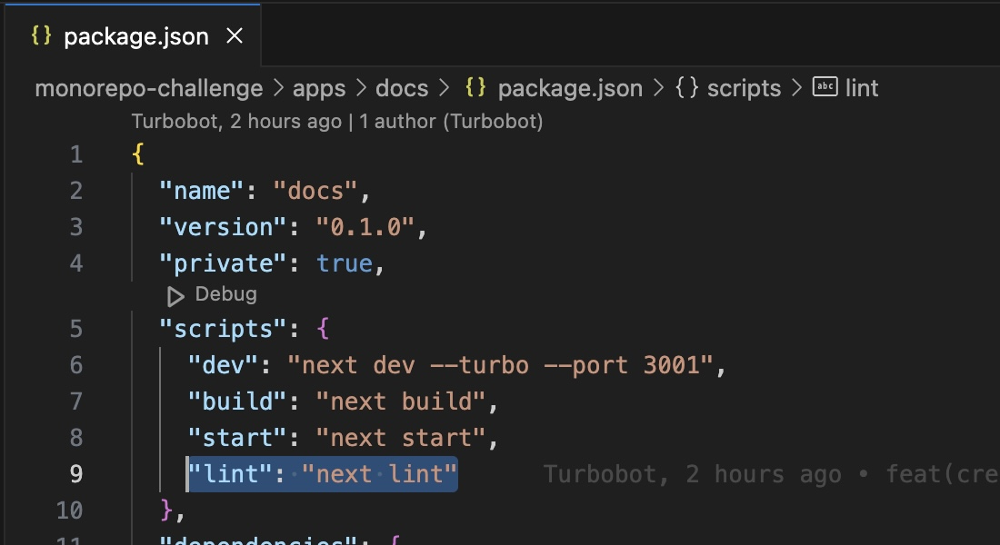

# Create a Monorepo with Turbo - Solution

This challenge has 5 steps to complete:

1. Understanding the Monorepo concept.
2. Create a Monorepo using Turbo.
3. Understanding Turbo Monorepo
4. Push your codes to GitHub

## 1. Understanding the Monorepo Concept

You can finish this step by reading the suggested resources.

1. [Understanding Monorepos](https://monorepo.tools/)
2. [What is Monorepo](https://semaphoreci.com/blog/what-is-monorepo)

## 2. Create a Monorepo Using Turbo

This guide provides the instructions to create a Monorepo using Turbo and helps you understand the turbo basics.

### Step 1: Create Turbo project

Make sure you are in the folder where you want to create the project and open it in the Command line. Run this below command:

```
npx create-turbo@latest
```

### Step 2: Enter y to install create-turbo:

Press "y" when the CLI prompts to install create-turbo package.

Once this package is installed, you will be prompted with the following questions on your CLI:

### Step 3: Choose a folder location for your turborepo

_Where would you like to create your turborepo?_


Enter a new folder name for your Turbo project.

### Step 4: Choose a package manager:

_Which package manager do you want to use?_



Turbo recommends pnpm. Choose pnpm as your package manager.

After you choose the package manager, `create-turbo` package creates a bunch of files and folders inside your selected folder for Turborepo (Remember when you were asked this question above?) and also installs the dependencies that come with this basic example.


## 3. Understanding Turbo Monorepo

when you create a new monorepo, `create-turbo` command gives you a description of folders it creates.

```
>>> Creating a new turborepo with:

Application packages
 - apps/web
 - apps/docs
Library packages
 - packages/eslint-config
 - packages/typescript-config
 - packages/ui
```

These folders are called workspaces. Each workspace has its own package.json, runs its scripts, and exports code that can be used by other workspaces in the Monorepo.

### packages/ui, a shared component library

Open `package/ui/package.json` and you will find the name as `@repo/ui`.


If you open `apps/web/package.json` and `apps/docs/package.json`, you will find `@repo/ui` as a dependency.


`packages/ui` is a shared component library because `apps/web` and `apps/docs` depend on `packages/ui` for a consistent, single-design system

#### How does packages/ui share code?

Inside `./apps/docs/app/page.tsx`, you will find the below import.



Button is imported from `@repo/ui/button` but, how is this exported from `packages/ui`?

You will find `exports` field in `packages/ui/package.json`.



components from `packages/ui` are exported using the exports field.

For example, when `apps/web` workspace file imports a shared component, say `Button`, from `packages/ui`, `exports` tells the `apps/web` workspace where to find this Button component.



### typescript-config workspace

You will find that this workspace is named `@repo/typescript-config` in `packages/typescript-config/package.json`.

To share a single tsconfig.json across the monorepo, you can use this typescript-config workspace by importing `@repo/typescript-config/nextjs.json` in `apps/web/tsconfig.json`.



### eslint-config workspace

You will find that this workspace is named `@repo/eslint-config` in `packages/eslint-config/package.json`.

To share a single eslint config file across the Monorepo, you can use this eslint-config workspace by importing `@repo/eslint-config/next.js` in `apps/docs/.eslintrc.js`.



To summarise, the following list shows dependencies among workspaces:

1. `web` - depends on `ui`, `typescript-config`, and `eslint-config`
2. `docs` - depends on `ui`, `typescript-config`, and `eslint-config`
3. `ui` - depends on `typescript-config` and `eslint-config`
4. `typescript-config` - no dependencies
`eslint-config` - no dependencies

Turborepo CLI does not manage these dependencies. Your package manager (`npm`, `pnpm` or `yarn`) handles the workspace dependencies.

### `turbo.json` explained

Turborepo makes running tasks simpler and more efficient.

code inside `turbo.json`:

```
{
 "$schema": "https://turbo.build/schema.json",
 "tasks": {
 "build": {
 "dependsOn": ["^build"],
 "inputs": ["$TURBO_DEFAULT$", ".env*"],
 "outputs": [".next/**", "!.next/cache/**"]
 },
 "lint": {
 "dependsOn": ["^lint"]
 },
 "dev": {
 "cache": false,
 "persistent": true
 }
 }
}
```

What the code above means is that we have 3 tasks registered in `turbo.json`.

1. `build`
2. `lint`
3. `dev`

To run a specific task, you can use the command below:

```
turbo run <task>
```

or using a shorter version:

```
turbo  <task>
```

### turbo run lint

Run the command `turbo run lint` and notice what happens in your CLI.

Because workspaces such as `ui`, `docs` and `web` depend on eslint config provided by the shared workspace `eslint-config`, you will find that the command you just ran triggers the lint scripts in the dependent workspaces.

#### lint script in `ui` workspace


#### lint script in `web` workspace


#### lint script in `docs` workspace



You will also see `0 cached, 3 total` in your CLI.

#### Caching turbo task

Run the lint task without changing any code in workspaces, commands execute quickly and runtime is shorter because Turborepo recognizes that no code has been changed, hence it replays the previous task run log.

Let's make a change in `ui` workspace. Change the onClick method's alert message from:

```
<button
 className={className}
 onClick={() => alert(`Hello from your ${appName} app!`)}
>
```
to

```
<button
 className={className}
 onClick={() => 
 alert(`Hello there, this alert is from your ${appName} app!`)
 }
>
```

What we are changing is the alert message from `Hello from your ${appName} app!` to `Hello there, this alert is from your ${appName} app!`.

Run the lint again. You'll find that:

1. `ui:lint` has a comment saying `cache miss`, executing. This means that `ui` workspace is running its linting script.
2. `2 cached, 3 total` appears at the bottom.

Since only `ui` workspace had code changes, its lint script is run. Other workspace results are cached from previous runs.

### turbo run build

Check for the `build` key in `scripts` in `package.json`. You will find that `build` script is available only for `web` and `docs` packages since `ui` package is a shared workspace.

Run the below command to run the `build` scripts defined in `web` and `docs` workspaces.

```
turbo run build
```

#### Caching `build` results:

`outputs` defined in `build` task in `turbo.json` are the build outputs in workspaces. For example, in the `app/web`, once the `turbo build` is run, build script in `app/web` produces the Next.js build located at `./next` folder. 

`turbo` caches the folders mentioned in the build task's `outputs`

### turbo run dev

Run the below command.

```
turbo run dev
```
This above command executes the `dev` script in `web` and `docs` workspaces but not in `ui` workspace since it does not have `dev` script.

`dev` scripts are run simultaneously, starting the dev servers on ports `3000` and `3001`.

There is no caching in the `dev` task.

```
{
 "pipeline": {
 "dev": {
 "cache": false,
 "persistent": true
 }
 }
}
``` 

since `dev` command runs a development server and produces no results, the cache is disabled, and persistent is set to true. 

To run dev script in a specific workspace, use the below command.

```
turbo dev --filter docs
```

## 4. Push your codes to Github

### Create a Repository in GitHub

This video shows how you can create a GitHub repository.

[Insert video execution. Loom or Github?]

Or you can follow the official documentation to [create a repository](https://docs.github.com/en/repositories/creating-and-managing-repositories/quickstart-for-repositories).

Please __do not__ check the 'Add a README file' option when creating a new repository, because you need to create an empty git repository.

### Link Your Turbo Monorepo to the GitHub Repository

When you create Turbo Monorepo with `npx create-turbo@latest`, it initializes a local Git repository by default.

Now, After your new GitHub repository created, you can link your Turbo Monorepo with the GitHub repository.

In the command line, go to your turbo project, and run this command.

```
git remote add origin git@github.com:<your-github-username>/<your-github-repo>.git
git push -u origin main
```

If your PC is already authenticated to your GitHub account, the command above should be successful and your Turbo Monorepo is now pushed to GitHub. But, if it prompts an authentication request, you can insert your GitHub account credentials.

You can read about GitHub Authentication [here](https://docs.github.com/en/authentication/keeping-your-account-and-data-secure/about-authentication-to-github).