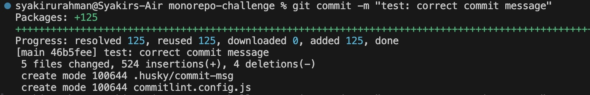

# Husky configuration solution

This challenge has 3 steps to complete:

1. Read the [husky documentation](https://typicode.github.io/husky/).
2. Install the husky in your Monorepo project.
3. Figure out how to lint your commit messages.

## 1. Read the Husky documentation

Make sure you read the following before you move on to the next steps.

1. [Husky introduction](https://typicode.github.io/husky/)
2. [Get Started](https://typicode.github.io/husky/get-started.html)

## 2. Install the husky in your Monorepo project

Let's follow the steps provided in [Get Started](https://typicode.github.io/husky/get-started.html)

### Install command

Run the below command at the root of your Monorepo

```
pnpm install --save-dev husky --workspace-root
```

> Remember to use your chosen package manager at the time of setting up your Monorepo.

If you use `pnpm`, you need to add `--workspace-root` to the command anytime you want to install a package in the workspace level root (Monorepo root folder)

### husky init

Husky recommends using `init` command. The init command simplifies setting up Husky in a project. It creates a `pre-commit` script in `.husky/` and updates the prepare script in `package.json`. Modifications can be made later to suit your workflow.

```
pnpm exec husky init
```

Take some time and understand the files inside `.husky` folder at the root of your project.

#### `pre-commit` hook

By default, husky creates a file named `pre-commit` containing the code below:

```
pnpm test
```

If you want to run tests before a git commit, you can put your test scripts in this file but [`.husky` folder in `shadcn-ui/ui`](https://github.com/shadcn-ui/ui/tree/main/.husky) does not have `pre-commit` file.

For now, you can delete the `pre-commit` file.

#### `commit-msg` hook

 [`.husky` folder in `shadcn-ui/ui`](https://github.com/shadcn-ui/ui/tree/main/.husky) has a single file named `commit-msg` and it contains the below code:

```
#!/usr/bin/env sh
. "$(dirname -- "$0")/_/husky.sh"

npx commitlint --edit $1
```

## 3. Figure out how to lint your commit messages.

[`commit-msg` hook in shadcn-ui/ui](https://github.com/shadcn-ui/ui/blob/main/.husky/commit-msg) uses the below command to lint commit messages.

```
#!/usr/bin/env sh
. "$(dirname -- "$0")/_/husky.sh"

npx commitlint --edit $1
```

[commitlint](https://commitlint.js.org/guides/getting-started.html) is used to lint your commit messages.

Do read the below `commitlint` guides:

1. https://commitlint.js.org/guides/getting-started.html
2. https://commitlint.js.org/guides/local-setup.html

### Install `commitlint`

Run the below command to install `commitlint` as your dev dependency:

```
pnpm add --save-dev @commitlint/{cli,config-conventional} --workspace-root
```

### Configure `commitlint`

You need `commitlint.config.js` for this `commit-msg` hook to work. Run the below command after installing `commitlint`.

```
echo "export default { extends: ['@commitlint/config-conventional'] };" > commitlint.config.js
```

### Create `commit-msg` hook

Create a commit-msg hook in your project by running the code below:

```
echo "pnpm dlx commitlint --edit \$1" > .husky/commit-msg
```

### Test your commit-msg hook

By default, `commitlint` lint your commit message with this format `[commit_type]: [commit_message]`. For instance:

```
feat: add x feature
```

You can test your commit-msg hook by staging `.husky` folder using the command below in your CLI:

```
git add .husky/
```

Let's write a commit message that does not adhere to `commitlint` rules.


Now let's write a commit message that adheres to `commitlint` rules.



> If you encounter the error `SyntaxError: Unexpected token 'export'` when running `git commit`, change the `export default` in `commitlint.config.js` to `module.exports =`

Further reading:
1. https://www.conventionalcommits.org/en/v1.0.0/
2. https://commitlint.js.org/reference/rules.html
3. https://github.com/conventional-changelog/commitlint/?tab=readme-ov-file#what-is-commitlint